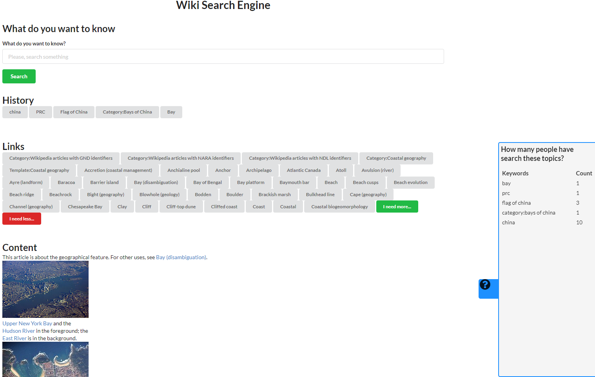

# Wiki Search Engine
## Description
You can search in this website. The website can display your search result and relative links. 
It also records your search history in browser so that you can go back any time you want.
In the part of links, you can choose to display more links or less links by click the button.
There is a small board on the right of website. After clicking it, it can show you some statistics.

This project is made by [Yibo Zhao](http://18.144.2.153:8080/).

## Demo
Run this project on your machine.


## How to run
```
git clone https://github.com/beefman92/web-final-exam
cd web-final-exam
meteor npm install
meteor // Then the project is running and go to localhost:3000 to see the website.
```

## Feature
+ Search keyword.
+ Go back in history.
+ Show more links or less links
+ Get statistics about how many people have searched topics you are viewing now.

## Technology
During the development, we utilized following technologies
  * Meteor
  * node-wikipedia

## Reference to the class with link:
For more information about the class, please go to this page:
http://johnguerra.co/classes/webDevelopment_spring_2019/

## License
This repository is under MIT license.

## I finish this project in one more hour.
